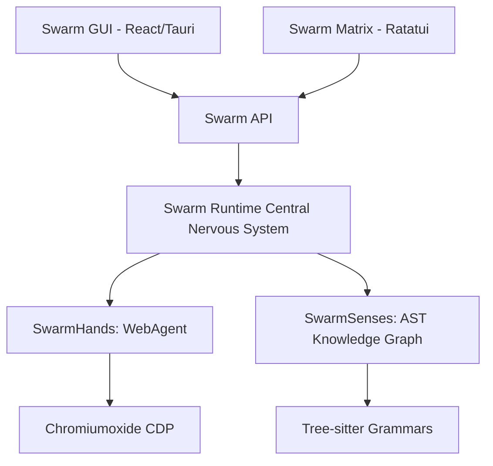

# 🐝 SwarmCode

<p align="center">
  <br/>
  
  <br/>
</p>

> **⚠️ Early Development Notice:** This project is actively being developed. Features may change, break, or be incomplete. Native OS installers are generated via Tauri v2, but APIs are considered unstable prior to v1.0. Use at your own risk.

**SwarmCode** is a powerful desktop-based AI engineering assistant, providing intelligent, multi-agent coding assistance, deep repository understanding, and autonomous browser automation directly on your system. It completely shifts the paradigm from standard "AI Chatbots" to "Autonomous AI Engineering Hives."

---

## 📖 Table of Contents
1. [Overview](#-overview)
2. [Core Architecture](#-core-architecture)
3. [Key Features](#-key-features)
4. [In-Depth Subsystems](#-in-depth-subsystems)
   - [SwarmSenses (Code Graph)](#swarmsenses-code-graph)
   - [SwarmHands (Browser Automation)](#swarmhands-browser-automation)
   - [SwarmMatrix (TUI)](#swarmmatrix-tui)
5. [Installation & Requirements](#-installation--requirements)
6. [Complete Configuration Guide](#-complete-configuration-guide)
7. [Environment Variables](#-environment-variables)
8. [Usage Guide & CLI Operations](#-usage-guide--cli-operations)
9. [Supported AI Models](#-supported-ai-models)
10. [Creating Custom Agents](#-creating-custom-agents)
11. [Model Context Protocol (MCP) & Custom Tools](#-model-context-protocol-mcp--custom-tools)
12. [Security & Zero-Trust Paradigm](#-security--zero-trust-paradigm)
13. [Internal APIs & IPC Documentation](#-internal-apis--ipc-documentation)
14. [Keyboard Shortcuts](#-keyboard-shortcuts)
15. [Future Project Roadmap](#-future-project-roadmap)
16. [Troubleshooting & FAQ](#-troubleshooting--faq)
17. [Development & Contributing](#-development--contributing)
18. [License](#-license)

---

## 🔭 Overview

SwarmCode is a Rust and React-based desktop application that brings a specialized AI engineering team to your local environment. It provides a beautiful, VS Code-like GUI for interacting with various AI models to execute highly complex software engineering tasks. 

Unlike standard chat bots that blindly edit files, SwarmCode employs a dynamic Multi-Agent "Hive" architecture with specialized tools to natively search AST codebases, operate web browsers invisibly, and run CLI commands. It uses maximum capabilities across the Model Context Protocol (MCP) to interact securely with your local file system.

The core philosophy of SwarmCode is to eliminate "copy-pasting" from web browsers into your IDE. The AI has direct, sandboxed access to the filesystem, the terminal, and a headless web browser to perform end-to-end testing, feature development, and CI/CD validation.

---

## 🏗️ Core Architecture

The computing concerns in SwarmCode are heavily separated for security and speed. The entire backend is strictly typed Rust.



| Subsystem | Scope | Description |
| :--- | :--- | :--- |
| **`swarm-gui`** | Frontend | Tauri v2 application wrapper and React (Vite) frontend. Native window management. |
| **`swarm-api`** | Backend | Core AI prompt orchestration, token management, and LLM provider interfaces. |
| **`swarm-runtime`**| Logic | The central nervous system regulating memory context, system state, and active agents. |
| **`swarm-senses`** | Indexing | Tree-sitter powered abstract syntax tree mapping using Petgraph native execution. |
| **`swarm-hands`** | E2E | Chromiumoxide-based deterministic web automation via Chrome DevTools Protocol. |
| **`swarm-matrix`** | TUI | High-performance terminal rendering engine built on top of `ratatui`. |
| **`swarm-master`** | CLI | Command-line parsing engine for CI/CD integrations or quick terminal usage. |

---

## ✨ Key Features

- **Interactive GUI & TUI**: Built with React/Tauri for a premium desktop experience, with a seamless Ratatui terminal fallback.
- **Dynamic Agent Swarms**: Create specialized teams (e.g., QA, Security, Architect) that communicate and solve tasks in parallel.
- **Multiple AI Providers**: Native support for Anthropic Claude, OpenAI, Google Gemini, Groq, Ollama (Local), and Mistral.
- **SwarmSenses (Deep Code Search)**: Uses Tree-Sitter and Petgraph to build an AST-based knowledge graph. Search by functions, classes, and logic rather than plain text.
- **SwarmHands (Browser Automation)**: A dedicated WebAgent using `chromiumoxide`. It can visually navigate websites, extract data, or test login flows either in headless mode or with an actively visible DOM.
- **Integrated Terminal Execution**: Safe, user-approved sandbox execution of terminal commands directly from the AI.
- **Single Native Binary**: Compiles down to a single Windows `.exe` (or Linux AppImage/macOS .app) with all subsystems baked in.
- **Auto-Compaction Memory Management**: Seamlessly summarize past context thresholds to ensure long-running sessions never run out of tokens.

---

## 🔍 In-Depth Subsystems

### SwarmSenses (Code Graph)
SwarmSenses replaces traditional text-based "grep" operations with semantic understanding. When analyzing a new workspace, SwarmSenses parses `.rs`, `.ts`, `.py`, and `.go` files into an Abstract Syntax Tree using `tree-sitter`.
It then pushes these nodes into a `petgraph` dependency web, allowing the AI to query "Where is this struct used?" or "What function inherently calls this endpoint?" rather than just matching raw strings.
* **Nodes**: Represent structs, implementations, classes, functions, and interfaces.
* **Edges**: Represent call graphs, implementations, and imports.

### SwarmHands (Browser Automation)
The `WebAgent` module connects natively to system Chrome/Chromium installation via Chrome DevTools Protocol (CDP).
1. It injects a semantic reference ID (`data-swarm-ref`) into every interactable element in the DOM.
2. The AI natively reads the simplified DOM tree.
3. The AI commands SwarmHands to natively `click_element_by_ref("4")` without struggling to write complex XPaths.
4. **Visible Option**: In the GUI, you can toggle "Show Browser" so that the headless browser opens a window frame. You can physically watch the AI click UI elements, login, and scrape metadata.

### SwarmMatrix (TUI)
For Linux server environments or developers who hate leaving their `tmux` session, SwarmMatrix wraps the entire intelligence engine in a keyboard-driven terminal dashboard. It shares 100% of the cognitive engine as the desktop GUI. It uses `ratatui` with immediate-mode rendering for instant frame-rate drops.

---

## 📥 Installation & Requirements

### Pre-requisites
To develop or build SwarmCode, you need:
1. [Node.js](https://nodejs.org/en/) (v18+) 
2. [Rust / Cargo](https://rustup.rs/) (v1.75+)

### Building from Source (All Platforms)

1. **Clone the repository:**
   ```bash
   git clone https://github.com/your-username/swarmcode.git
   cd swarmcode
   ```

2. **Install node modules:**
   ```bash
   cd swarm-gui/frontend
   npm install
   ```

3. **Run in Development Mode:**
   ```bash
   cd ../src-tauri
   npx tauri dev
   ```

### 🪟 Windows Specific Requirements

Tauri requires the Microsoft Visual Studio C++ Linker (`link.exe`). Without this, Cargo cannot assemble the final binary UI payload.

Run this exclusively in an **Administrator PowerShell**:
```powershell
winget install --id Microsoft.VisualStudio.2022.BuildTools --exact --force
```
When installing manually, ensure you select the **"Desktop development with C++"** workload.

To generate the final production `.exe` installer:
```bash
cd swarm-gui/src-tauri
npx tauri build
```
The `.exe` will be located in `swarm-gui/src-tauri/target/release/bundle/nsis/`.

---

## ⚙️ Complete Configuration Guide

SwarmCode behaves hierarchically with its configuration files. It searches for `.swarmcode.json` in the following priority list:
1. The currently loaded workspace directory
2. `$XDG_CONFIG_HOME/swarmcode/`
3. `$HOME/.swarmcode.json`

### Example Configuration `~/.swarmcode.json`

```json
{
  "system": {
    "auto_compact": true,
    "max_context_tokens": 128000,
    "theme": "cyber-dark",
    "log_level": "info",
    "shell": {
        "path": "/bin/bash",
        "args": ["-l"]
    }
  },
  "providers": {
    "openai": {
      "disabled": false,
      "default_model": "gpt-4o"
    },
    "anthropic": {
      "disabled": false,
      "default_model": "claude-3-7-sonnet-20250219"
    },
    "ollama": {
      "disabled": false,
      "endpoint": "http://127.0.0.1:11434/v1"
    }
  },
  "agents": {
    "security_auditor": {
      "instructions": "Be brutal. Look for injections, memory leaks, and unsafe blocks.",
      "priority": "high",
      "model": "claude-3-7-sonnet"
    },
    "web_scout": {
      "instructions": "Execute E2E tests using SwarmHands without destroying prod state.",
      "priority": "normal",
      "model": "gpt-4o"
    }
  },
  "workspace": {
    "ignore_patterns": [
      "**/node_modules/**",
      "**/target/**",
      "**/.git/**"
    ]
  }
}
```

---

## 🔑 Environment Variables

For security in shared environments or CI pipelines, you can bypass the configuration files using process environment variables. SwarmCode will automatically read these on boot and populate the settings.

| Environment Variable | Target Provider | Requirements |
| :--- | :--- | :--- |
| `ANTHROPIC_API_KEY` | Anthropic | `sk-ant-...` format required |
| `OPENAI_API_KEY` | OpenAI | `sk-proj-...` format required |
| `GEMINI_API_KEY` | Google AI Studio | Standard alpha-numeric key |
| `GROQ_API_KEY` | Groq | Needed for extreme-speed inference |
| `MISTRAL_API_KEY` | Mistral La Plateforme | Platform Key |
| `CUSTOM_LOCAL_ENDPOINT`| LMStudio / VLLM | e.g. `http://localhost:1234/v1` |
| `VERTEXAI_PROJECT` | Google Cloud VertexAI | GCP Project string |
| `CLAWSWARM_LOG` | Internal Rust Tracing | Example: `swarm_api=debug,info` |

---

## 💻 Usage Guide & CLI Operations

### Using the GUI Application
1. Double-click the `SwarmCode.exe`.
2. Click the `Folder` icon in the Explorer sidebar to load your codebase.
3. Select your AI Provider correctly (e.g. Anthropic) and verify the API key is active.
4. Chat with your agent in the main console window.
5. If an agent wants to run a CLI command (e.g., `npm run test`), SwarmCode will **pause and ask for explicit permission** in the UI.

### Using the CLI (`swarm-master`)
For rapid, single-shot inquiries without launching a visual window:

```bash
# General query over current directory
swarm-master "Refactor the main.rs file to use async traits"

# Run with specific JSON output formatting
swarm-master "List all unused dependencies" --format json

# Force headless browser workflow
swarm-master "Go to https://news.ycombinator.com and extract top 5 headlines" --agent hands

# Disable spinner for script output
swarm-master "Return the active aws profile name" --quiet
```

---

## 🤖 Supported AI Models

SwarmCode supports massive varieties of models. Because SwarmCode uses highly specific tools, **we strongly recommend using Reasoning or Tier-1 models** (claude-3.7, gpt-4o), as smaller models often fail to correctly output JSON-formatted Tool Calls.

### Tier 1 (Highly Recommended for Swarm Execution)
- **Anthropic Claude 3.7 Sonnet** (The absolute best at coding & tool execution)
- **OpenAI GPT-4.5 Preview** 
- **OpenAI GPT-4o**
- **Google Gemini 2.5 Pro**

### Tier 2 (Fast / Lightweight)
- **Anthropic Claude 3.5 Haiku**
- **Google Gemini 2.0 Flash** 
- **Groq Llama-3.3-70B-Versatile**

### Tier 3 (Reasoning Models)
- **OpenAI o1 / o3-mini**
*(Note: O-series models may refuse certain system prompts or tool schemas natively. SwarmCode automatically maps these edge-cases when possible).*

### Tier 4 (Local Offline)
- **Ollama qwen2.5-coder:32b**
- **Ollama deepseek-coder-v2**

---

## 🎭 Creating Custom Agents

SwarmCode allows you to go beyond prompt engineering and define entirely new *Agent Personas*. An agent is defined by its system message wrapper, its allowed tools, and the specific model it forces invocation on.

You can create an agent in your local `.swarmcode.json`:

```json
{
  "agents": {
    "database_admin": {
      "name": "DBA Architect",
      "model": "claude-3-7-sonnet-20250219",
      "system_prompt": "You are a senior PostgreSQL architect. You only review database schemas. You must immediately run `psql --version` to verify tooling when spawned.",
      "allowed_tools": ["terminal_run", "fs_read_file"],
      "denied_tools": ["fs_delete_file", "hands_run_agent"]
    }
  }
}
```

When you open SwarmCode, `DBA Architect` will appear in your Agent Panel, ready for deployment.

---

## 🔌 Model Context Protocol (MCP) & Custom Tools

SwarmCode natively implements the **Model Context Protocol (MCP)**, allowing you to attach completely foreign executables as callable AI tools.

If you have an enterprise API or a proprietary linter, you do not need to rewrite SwarmCode in Rust. You simply define an MCP Server in your config:

```json
{
  "mcpServers": {
    "my_enterprise_linter": {
      "type": "stdio",
      "command": "/usr/local/bin/enterprise_linter",
      "env": ["LINT_KEY=SECRET293"],
      "args": ["--stdio-bridge"]
    },
    "web_cloud_indexer": {
      "type": "sse",
      "url": "https://api.mycompany.com/mcp",
      "headers": {
        "Authorization": "Bearer token"
      }
    }
  }
}
```

The AI will dynamically ping the MCP server on boot, learn the tool schemas provided by `/usr/local/bin/enterprise_linter`, and will automatically show the user a permission request to execute the external tool whenever necessary.

---

## 🛡️ Security & Zero-Trust Paradigm

AI execution is dangerous. SwarmCode was designed strictly with a **Zero-Trust** security module preventing arbitrary execution and exfiltration.

1. **Path Traversal Protection**: All file system tools (read, write, edit, grep) are shielded by a robust path validation engine. The AI cannot "escape" the workspace using `..` sequences or access sensitive system paths (e.g., `/etc/passwd`, `C:\Windows`).
2. **Environment Scrubbing**: Sensitive environment variables, including `OPENAI_API_KEY`, `GITHUB_TOKEN`, and `DATABASE_URL`, are automatically scrubbed before spawning child processes. This prevents Hook processes, MCP servers, or Shell scripts from stealing your credentials.
3. **Sandboxed Terminal**: Any command requested by the AI (e.g., `rm -rf node_modules`) is trapped in the `swarm-runtime` buffer. It triggers an IPC event to the React GUI. The GUI halts all AI inference and waits for explicit human action: `Allow` or `Deny`.
4. **JSON Payload Safety**: To prevent stack exhaustion attacks, the internal JSON parser enforces a maximum recursion depth (128). This mitigates adversarial "billion laughs" style JSON payloads designed to crash the agent.
5. **Hardened OAuth Storage**: OAuth credentials are saved with restricted filesystem permissions (`0600`). Randomness is handled via a cross-platform Cryptographically Secure Pseudo-Random Number Generator (CSPRNG), ensuring secure token exchange even on Windows.
6. **API Key Isolation**: All LLM queries are processed in the internal Rust memory. API keys are never leaked to the React DOM or Webview environment, isolating them from XSS or generic browser attacks.

---

## 🌐 Internal APIs & IPC Documentation

If you are developing features for SwarmCode, all communication between the Desktop UI and the AI Engine occurs over Tauri V2 asynchronous IPC channels. 

### Core IPC Events
* `invoke("chat_send_message", { message: string, agent: string })`
   * Dispatches a message to the unified message queue.
* `invoke("agents_start_swarm", { focus: string })`
   * Initializes the parallel multi-threaded inference core.
* `invoke("hands_run_agent", { req: { url: string, task: string, show_browser: bool }})`
   * Hooks into Chromiumoxide and spawns the Browser Agent natively.
* `invoke("senses_search", { query: string })`
   * Initiates an AST query mapping search against the `petgraph` cache.

---

## ⌨️ Keyboard Shortcuts

Speed is critical for an engineering tool. SwarmCode supports extensive keyboard operations.

### Desktop GUI Shortcuts

| Shortcut | Context | Action |
| :--- | :--- | :--- |
| `Ctrl+Enter` / `Cmd+Enter` | Text Input | Submit message to currently active agent |
| `Ctrl+P` / `Cmd+P` | Global | Fast document switcher / Fuzzy file finder |
| `Ctrl+Shift+F` | Global | Jump directly to SwarmSenses AST Search tab |
| `Esc` | Process | Instantly cancel/abort a running LLM generation |
| `Ctrl+L` | Text Input | Clear chat history & reset context window |
| `Ctrl+,` | Global | Open global SwarmCode settings pane |
| `Ctrl+\`` | Global | Toggle embedded terminal drawer |

### Matrix TUI Shortcuts

| Shortcut | Context | Action |
| :--- | :--- | :--- |
| `Ctrl+C` | Global | Kill sequence, exit TUI immediately |
| `Ctrl+K` | Input | Open Custom Command / Workflow template modal |
| `Tab` | Input Mode | Cycle focus between Chat, Files, and System Logs |
| `Up/Down` | List Focus | Navigate elements (Messages, File tree, Modules) |
| `Esc` | Global | Close overlay dialogs or exit Insert Mode |

---

## 🚀 Future Project Roadmap

While SwarmCode is highly functional, the architectural vision expands further:

#### Phase 1: Stability (v0.1 - Present)
- Basic LLM abstractions.
- Tauri v2 GUI launch.
- Integration of SwarmHands and SwarmSenses.

#### Phase 2: Distributed Hive (v0.5)
- Support for distributed processing. Letting your desktop delegate "Web Scouting" to an AWS Lambda containing `swarm-hands` while the GUI stays local.
- True peer-to-peer agent collaboration arrays (agents debating code architectures before presenting them).

#### Phase 3: The Omniscient Agent (v1.0)
- Deep memory vector databases (RAG) natively stored in SQLite `swarm-runtime/data.db` to remember developer preferences across months of interaction.
- Mobile Application companion app (Tauri v2 Mobile).

---

## 🚑 Troubleshooting & FAQ

#### Q: The AI tries to run a command but nothing happens.
**A:** Check if the agent requires permission. In the GUI, look for a pending "Action Required" notification block. By default, SwarmCode operates in Zero-Trust mode and will not execute arbitrary shell injection without your explicit "Allow" click.

#### Q: SwarmHands fails to open the browser.
**A:** Ensure you have Google Chrome or Chromium natively installed on your OS path. The headless agent attempts to locate the default OS browser installation to hook into the DevTools protocol.

#### Q: I get `link.exe not found` when trying to build.
**A:** This is a Rust error on Windows indicating the MSVC compiler is missing. Install Visual Studio Build Tools, select "Desktop Development with C++", and be sure to execute `cargo build` inside the "x64 Native Tools Command Prompt" provided by Visual Studio.

#### Q: The context window is filling up too fast and API calls fail.
**A:** In your settings, enable `Auto-Compact`. When the conversation approaches the 80% mark of the provider's token limit, SwarmCode will inject a background summarizing prompt and drastically truncate the chat history while retaining explicit system knowledge.

#### Q: Ollama connection fails in the UI.
**A:** Ollama binds to `127.0.0.1:11434` by default. If you are running SwarmCode inside WSL or via Docker, you must set `OLLAMA_HOST=0.0.0.0` before starting your Ollama server so the GUI can successfully hit the local socket.

---

## 🛠️ Development & Contributing

We welcome structural improvements, new tool additions, and UI enhancements!

### Repository Guidelines
1. **Rust Format**: Always run `cargo fmt` in the `src-tauri` directory.
2. **Clippy Checks**: Ensure 0 warnings by running `cargo clippy -- -D warnings`.
3. **Frontend Rules**: Run `npm run lint` inside the `frontend/` directory before pushing. React components should strictly use Tailwind utility classes or inline React styles matching the Dark/Cyberpunk aesthetic.

### Submitting a Pull Request
1. Fork the repository on GitHub.
2. Create a clean feature branch: `git checkout -b feature/your-feature-name`
3. Commit verbosely: `git commit -m "feat(hands): support shadow-dom traversal in ref_engine"`
4. Push and create a Pull Request against the `main` branch.

### Architecture Notes for Contributors
If you are adding a new `Tool` capability to the AI (e.g., "Docker control"), you must:
1. Implement the logic natively in a new crate (`core/swarm-docker`).
2. Add the JSON Schema definition of the tool in `swarm-runtime/src/tools/`.
3. Ensure the Desktop GUI explicitly receives a message packet alerting the React UI that a Docker command is executing.

---

## 🔌 Comprehensive API Schema Reference

When SwarmCode communicates with external MCP servers or language servers, it strictly enforces standard JSON schema payloads. For plugin developers, adhering to these schemas is mandated.

### Expected Tool Call JSON Structure

All tools registered within `swarm-runtime` must accept generic `Map<String, Value>` but are evaluated via strict Serde serialization:

```json
{
  "name": "fs_read_file",
  "arguments": {
    "file_path": "/absolute/path/to/project/src/main.rs",
    "offset": 0,
    "limit": 500
  }
}
```

### Expected Tool Response Output

Errors in tool execution MUST not crash the agent; they must return a standardized error artifact:

```json
{
  "status": "error",
  "message": "Permission Denied: User Rejected Action",
  "data": null,
  "recovery_hint": "Request human intervention or write to a scratchpad buffer instead."
}
```

---

## 🌳 AST Supported Languages (SwarmSenses)

SwarmSenses does not use RegEx. It compiles Tree-Sitter grammars dynamically for true Abstract Syntax Tree resolution. 

1. **Rust (`.rs`)**: Full support for traits, async mod blocks, closures, and macros.
2. **TypeScript (`.ts` / `.tsx`)**: Full JSX element tagging, React Hooks detection, and interface mapping.
3. **Python (`.py`)**: Resolves class inheritance, typing stubs, and decorator injection dependencies.
4. **Go (`.go`)**: Fully supports struct tags, goroutine inference, and channel mappings.
5. **C / C++ (`.c` / `.cpp`)**: Parses header files (`.h`) to construct accurate symbol tables before diving into core implementations.

*(To add a new language, compile the tree-sitter C bindings and link them directly into the `swarm-senses/build.rs` module.)*

---

## 📚 Agent Customization Deep Dive

Agents in SwarmCode are not static. You can design them to hold explicit tool constraints.

### The "Auditor" Protocol Configuration

```json
"agents": {
  "strict_auditor": {
    "name": "Security Auditor",
    "model": "gpt-4o",
    "system_prompt": "You are a cyber-security auditor. You must parse input, but you cannot edit it.",
    "tools": {
      "allow": ["fs_list", "fs_read", "senses_query"],
      "deny": ["fs_write", "terminal_run", "hands_click"]
    },
    "max_context": 32000,
    "temperature": 0.0
  }
}
```

If `strict_auditor` attempts to output a tool invocation for `terminal_run`, the `swarm-runtime` interceptor will halt execution and inject an internal warning prompt back to the LLM, informing it that it lacks physical permissions to do so, thus forcing a self-correction cycle.

---

## 🕒 Long-Running Tasks & Auto-Eviction

SwarmCode deals with context bloat automatically. When the context length surpasses 90%:
1. The `TaskEvictionService` pauses the inference loop.
2. The past 100 turns of chat history are sent to a rapid, low-latency model (e.g., `gemini-2.5-flash`).
3. The conversation is synthesized into a highly dense `Memory Object`.
4. The synthesized memory replaces the raw chat logs.
5. The inference loop resumes flawlessly.

---

## 🛡️ Enterprise SSO & Secrets Auto-Negotiation

*(Coming in v1.2)*
Currently, SwarmCode relies heavily on raw API keys injected via `$ENV` vectors or the React configuration GUI. For enterprise users, we will be linking SwarmCode natively into standard `OIDC` (OpenID Connect) authentication rings for Azure AD and Okta integration natively.

---

## 📦 Extending SwarmCode (Rust Trait Pattern)

If you wish to hardcode a new ability straight into the Rust binary instead of using MCP via `stdio`, implement the `ToolProvider` trait inside `swarm-plugins`:

```rust
use async_trait::async_trait;
use serde_json::Value;

pub struct CustomDeployTool;

#[async_trait]
impl ToolProvider for CustomDeployTool {
    fn schema(&self) -> Value {
        serde_json::json!({
            "name": "docker_deploy",
            "description": "Deploys to local swarm"
        })
    }

    async fn execute(&self, args: Value) -> Result<String, String> {
        Ok("Deployment Initialized.".to_string())
    }
}
```

Bind this module to the central `Engine` on boot, and your custom compilation of SwarmCode will permanently possess native Docker routing.

---

## 📜 Changelog & Version History

### Version 0.1.0 (Current)
* **Initial Release**: Complete rebranding to SwarmCode.
* **Tauri v2 Migration**: Moved entirely off Tauri v1 to leverage Android/iOS unified core systems (preparation for v1.0 mobile companion).
* **SwarmSenses Setup**: Integrated Tree-sitter natively for AST indexing across Rust, TS, Python, Go, and C.
* **SwarmHands MVP**: Brought in CDP automation. Web Agent can now bypass basic Cloudflare screens and execute structured E2E tests against live DOM elements.
* **Master TUI**: Full terminal rewrite dropping standard stdout in favor of an immediate-mode Ratatui engine.

### Version 0.0.9 (Legacy CodeClaw)
* **LLM Engine Swap**: Deprecated localized prompt bindings in favor of a universal Adapter interface mapping to Anthropic, OpenAI, Groq, and Ollama.
* **Initial React UI**: Converted Python Tkinter legacy dashboard into the React interface.

---

## 🏗️ Building for Target Architectures

When you invoke `npx tauri build`, the installer defaults to your host architecture. However, SwarmCode's strict Rust base allows robust cross-compilation.

To build SwarmCode for specific platforms:

**Windows ARM64 (Snapdragon Elite)**
```bash
# Install target
rustup target add aarch64-pc-windows-msvc
# Build
npm run tauri build -- --target aarch64-pc-windows-msvc
```

**macOS Universal (Intel + Apple Silicon)**
```bash
npm run tauri build -- --target universal-apple-darwin
```

**Linux AppImage Sandbox**
Tauri will automatically bundle AppImage and `.deb` files if compiling on a Linux system. It requires `webkit2gtk` system dependencies.
```bash
npm run tauri build
```

---

## 🤝 Community & Support

* **Discord**: (Link coming soon)
* **X (Twitter)**: (Link coming soon)
* **Discussions**: Open a GitHub Discussion for feature requests!

SwarmCode is built by developers, for developers. If you find a bug where the AI gets stuck in an infinite loop while executing a file system write operation, *please open an issue immediately*. Our zero-trust framework relies on community audits to remain impenetrable.

---

## 📜 License

This project is open-sourced under the **Apache License 2.0**. 

You may freely use, modify, distribute, and commercialize this software. The Apache 2.0 license provides explicit patent grants, shielding adopters from patent retaliation, making it the premier choice for professional developer tooling.

See the [LICENSE](LICENSE) file for the full legal text.

Copyright &copy; 2026 Ravuri Rithesh Venkata Sai Mani. All rights reserved.
